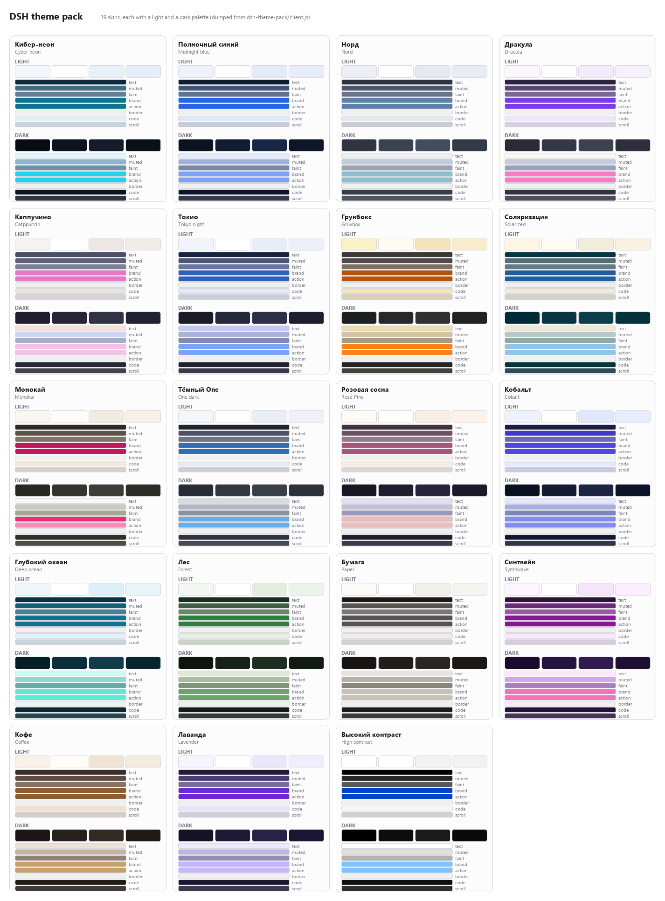

# DSH theme pack

A color theme pack for the [DeepSeek Harness](https://github.com/deepseek-ai/deepseek-harness)
web GUI: **18 skins**, each carrying a light *and* a dark palette, picked from
**Settings → General → Theme**.



## Themes

| Theme | Light | Dark |
| --- | --- | --- |
| **Cyber neon** | cool graphite with a cyan accent | near-black blue with neon cyan |
| **Midnight blue** | pale blue paper | deep navy with a bright blue accent |
| **Nord** | Snow Storm neutrals with Frost blue | Polar Night with Frost cyan |
| **Dracula** | soft lilac paper | the classic violet/pink Dracula |
| **Catppuccin** | Latte | Mocha |
| **Tokyo night** | cool light blue | Tokyo Night with a neon blue accent |
| **Gruvbox** | warm cream and orange | deep brown with the signature orange |
| **Solarized** | Solarized Light | Solarized Dark |
| **Monokai** | warm off-white with magenta | Monokai Classic |
| **One dark** | Atom One Light | Atom One Dark |
| **Rosé Pine** | Rosé Pine Dawn | Rosé Pine |
| **Cobalt** | pale indigo | deep indigo with electric violet |
| **Deep ocean** | pale aqua | abyssal teal with mint |
| **Forest** | pale sage | deep forest green |
| **Paper** | warm white, low chroma | warm charcoal, low chroma |
| **Synthwave** | lilac paper | purple with pink and cyan |
| **Coffee** | warm cream and brown | dark roast with caramel |
| **Lavender** | pale violet | deep violet |
| **High contrast** | pure black on white | pure white on black |

Every skin recolors the whole shell — canvas, raised surfaces, sidebar, borders,
text ladder, brand and buttons, semantic states, code blocks, scrollbars and
toasts. Each one is a **pair** of palettes, so switching
`Light / Dark / System` in Settings keeps the skin rather than breaking it.

## Install

Requires DeepSeek Harness Desktop (or `dsh web`) with a managed profile.

### From GitHub

```bash
git clone git@github.com:mrtoxiorg-sys/dsh-theme-pack.git
cd dsh-theme-pack
npm install --prefix "$DSH_PROFILE_DIR" file:"$PWD"
```

Then add the package to your profile's bundle list — in
`$DSH_PROFILE_DIR/package.json`:

```json
{
  "dsh": {
    "profile": {
      "bundles": ["@deepseek-ai/dsh-base", "@deepseek-ai/dsh-web-app", "@local/dsh-theme-pack"]
    }
  }
}
```

The same thing as a one-liner, keeping the entry list intact:

```bash
node -e '
const fs = require("node:fs"), path = require("node:path");
const dir = process.env.DSH_PROFILE_DIR;
const file = path.join(dir, "package.json");
const manifest = JSON.parse(fs.readFileSync(file, "utf8"));
const bundles = (manifest.dsh ??= {}).profile ??= {};
bundles.bundles ??= ["@deepseek-ai/dsh-base", "@deepseek-ai/dsh-web-app"];
(manifest.dependencies ??= {})["@local/dsh-theme-pack"] = "file:" + process.cwd();
if (!bundles.bundles.includes("@local/dsh-theme-pack")) bundles.bundles.push("@local/dsh-theme-pack");
fs.writeFileSync(file, JSON.stringify(manifest, null, 2) + "\n");
'
```

Restart DSH Desktop once so the new bundle is read. After that, edits to the
package are picked up live by the client-plugin HMR channel — no restart.

### Uninstall

Remove `@local/dsh-theme-pack` from `bundles` and from `dependencies`, then
delete `node_modules/@local/dsh-theme-pack` in the profile.

## Use

**Settings → General → Theme** shows one swatch per skin. Clicking one applies it
immediately everywhere and remembers the choice in `localStorage`
(`dsh-theme-pack:active`). Pick **Stock** to remove the layer and get the shipped
palette back.

There is no button in the sidebar on purpose: this build hides the sidebar's foot
area (`display: none` while the sidebar is wide), so a plug-in there would be
invisible. See [REFERENCE.md](REFERENCE.md) for that and the other integration
gotchas.

## How it works

The built-in Appearance picker only knows `light` / `dark` / `system`, and a
third-party `ctx.theme.register()` id never reaches the durable settings schema.
So instead of registering competing theme ids, the pack stacks **alias-token
override layers** on top of the active palette with
`ctx.theme.overrideTokens("@local/dsh-theme-pack", tokens)`.

Each skin declares ~18 color *atoms* per scheme (canvas, surfaces, text ladder,
brand, border, states…) and a small engine derives the 32 alias tokens from them:

* borders and interactive fills are composed over the canvas, so they stay flat
  colors that match any surface;
* the text ladder and brand colors are taken as authored, so contrast is checked
  rather than approximated.

Every generated palette is measured against WCAG contrast floors by the checker —
380 foreground/background pairs across the 18 skins. The current tightest pair has
a 4.03:1 ratio against a 4:1 requirement.

## Verify

```bash
node verify-theme-pack.mjs
```

The checker runs the real `client.js` inside a minimal module-loader / DOM / React
harness and asserts that:

* the bundle registers exactly one picker row in `settings.general.item` and
  **nothing** in the sidebar footer;
* every skin stacks exactly one override layer, `Stock` stacks none, and picking
  `Stock` removes the layer;
* all 32 overridden tokens exist in the shipped design system
  ([`design-platform.css`](design-platform.css), copied from
  `@deepseek-ai/dsh-client-ui-theme`);
* every token maps to a distinct light and dark value, and no two skins render
  the same palette;
* every pair that decides readability clears its contrast floor;
* both React resolution paths work — the loader builtin and the global fallback
  (a bare `React` must fail loudly, which is the bug this test exists for).

Useful when changing palettes:

```bash
DSH_THEME_MIN_CONTRAST=4 node verify-theme-pack.mjs   # loosen the floor
```

## Add or change a theme

1. Open [`client.js`](client.js) and find `THEMES`.
2. Copy a `theme(...)` call, change the `id`, the glyph and the two atom tables.
3. Add both names to `DICTIONARIES` (`theme.<id>` for `en` and `ru`).
4. Run the checker — it catches unknown tokens, missing palettes, duplicated
   schemes and contrast regressions.

`Stock` deliberately carries no atoms: its whole job is to remove the layer.

## Files

| Path | Purpose |
| --- | --- |
| `client.js` | Browser half: the palette engine, the theme catalogue, the picker row |
| `index.js` | Host half: empty, the loader row only needs to exist |
| `cordis.patch.yml` | The bundle patch that inserts the loader row |
| `design-platform.css` | The shipped alias-token tables the checker validates against |
| `REFERENCE.md` | Token map and integration gotchas |
| `docs/preview.png` | Palette preview |

## License

MIT — see [LICENSE](LICENSE).

---

# На русском

**18 тем** для веб-интерфейса DeepSeek Harness, каждая с парой палитр
(светлая и тёмная). Переключаются в **Настройки → Общие → «Темы»**; выбор
запоминается в `localStorage`. «Сток» возвращает штатную палитру.

Установка — см. раздел Install выше (нужен управляемый профиль DSH). После
первого добавления в `bundles` нужен один перезапуск DSH, дальше правки
подхватывает HMR клиентских плагинов.

Проверка палитр: `node verify-theme-pack.mjs` — гоняет настоящий `client.js`
в минимальном окружении и проверяет регистрацию, 32 токена против штатной
дизайн-системы, различимость схем и контраст по WCAG.
